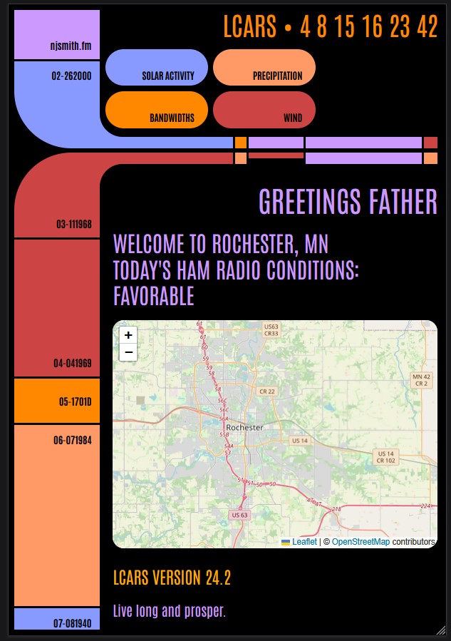

        

          <h1>HAM Radio App</h1>

          

           I've wanted to learn Svelte for a while, and to do something with physical computing on Raspberry Pi. I realized I could involve my dad and my little brother in this too, so they share in the credit on this project. (Consider them my henchmen.)
          

          

           My dad is a licensed HAM radio operator, but uses a wheelchair, so it's a challenge for him to get all his broadcasting equipment out and operate it. So I thought, maybe the process would be even so slightly easier if he could know right away in the morning which days are most suitable for making a day out of it, and taking all his stuff to the park, which is what he likes to do.
          

          

          So I set out to make a dashboard for him that'll let him know when it's a good day for operating, based on HAM radio bandwidths availability, solar activity, and weather forecasts in Southeast Minnesota. I made an interface using Svelte together with D3, and hosted the project on a Raspberry Pi which lives in his apartment, continually deployed on a local server, and which is configured with some LED lights that turn green when conditions are favorable for broadcasting. 
          

      <picture class="about-photo-mobile">
        <source
          srcset="img/LCARSapp.jpg"
          media="(max-width: 600px)"
        />
         </picture
    >
      
          

          
        

        

            <picture>
              <source
                srcset="img/LCARSapp.jpg"
                media="(min-width: 601px)"
              />
               </picture
          ></a>
        

        
